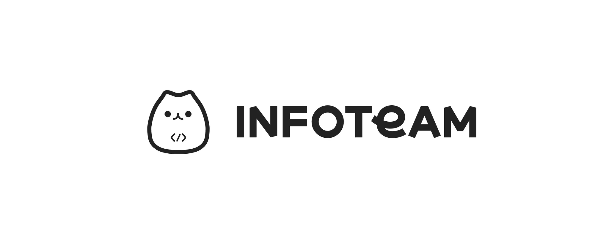

<!-- markdownlint-disable MD041 -->

# Infoteam

## Slogan

**지속 가능한 개발 문화를 통해 지스트 학부생들의 삶의 질을 높이는 팀!**

## Purpose

인포팀은 개발에 흥미를 가진 사람들이 지스트를 더 살기 좋은 곳으로 만들기 위해 모인 팀이다.  
  
누구는 정교한 코드를 짜는 것이 재미있을 수도, 누구는 예쁜 서비스를 만드는 것이 재미있을 수도, 누구는 사람들이 자신의 서비스를 많이 사용하는 것이 재미있을 수도 있다. 우리는 이러한 사람들이 모여 각자의 흥미에 따라 열심히 일하고 근사한 서비스를 만들어 나가는 것을 목표로 한다.

## Projects

- Ziggle
  - [Web (Next.js)](https://github.com/gsainfoteam/ziggle-fe)
  - [Groups Web (React.js)](https://github.com/gsainfoteam/groups-fe)
  - [Server (Nest.js)](https://github.com/gsainfoteam/ziggle-be)
  - [Groups Server (Nest.js)](https://github.com/gsainfoteam/groups-be)
  - [App (Flutter)](https://github.com/gsainfoteam/ziggle-flutter)
- infoteam IdP
  - [Web (React.js)](https://github.com/gsainfoteam/idp-fe)
  - [Server (Nest.js)](https://github.com/gsainfoteam/idp-be)
- Hey, Infoteam (cs)
  - [Web (React.js)](https://github.com/gsainfoteam/hey-developer-fe)
  - [Server (Nest.js)](https://github.com/gsainfoteam/hey-developer-be)
- Infopedia (internal service)
  - [Docker](https://github.com/gsainfoteam/infopedia)
- icarus project (infra)
  - GitOps
  - IaC (Terraform)
- bbun finder
  - [Web (Flutter)](https://github.com/gsainfoteam/bbun-finder-fe)
  - [Server (Nest.js)](https://github.com/gsainfoteam/bbun-finder-be)
- Pot G
  - [Server (Nest.js)](https://github.com/gsainfoteam/potg-be)
  - [App (Flutter)](https://github.com/gsainfoteam/pot-g-flutter)
